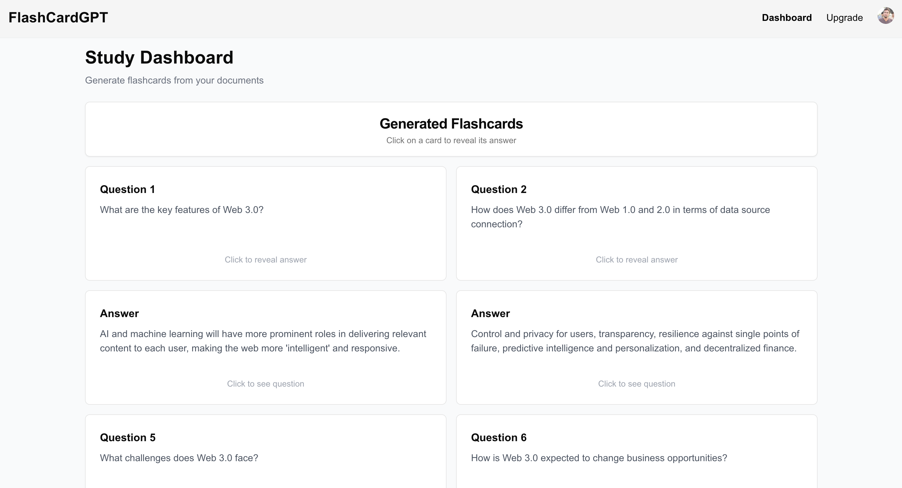

# FlashCardGPT

An AI tool that helps you revise concepts through flash cards.

## Table of Contents

- [Live Demo](#live-demo)
- [Features](#features)
- [Technologies Used](#technologies-used)
- [Getting Started](#getting-started)
  - [Prerequisites](#prerequisites)
  - [How to run the project](#how-to-run-the-project)
- [Screenshots](#screenshots)
- [How to use the application](#how-to-use-the-application)
- [Use Cases & Future Enhancements](#Use-Cases-&-Future-Enhancements)
- [Contributing](#contributing)
- [License](#license)
- [Acknowledgements](#acknowledgements)
- [Contact](#contact)
- [FAQ](#faq)

## Live Demo

https://ai-flash-card-generator-mauve.vercel.app/

## Features
- User-friendly access with Gmail login or email/password authentication.
- Generate flashcards by uploading text files.
- Each flashcard contains AI-generated questions and answers for effective study.
- Save, edit, and organize flashcards within custom folders.

## Technologies Used
- Next.js and React for Frontend and Backend
- OpenAI API Key for AI-Powered Features
- Clerk authentication for Authorization

## Getting Started

**Prerequisites**

- Next.js
- Clerk credentials
- OpenAI API Key

**How to run the project**

1. Clone the repository:
    ```bash
    git clone https://github.com/0xmetaschool/FlashCardGPT.git
    ```

2. Navigate to the project directory:
    ```bash
    cd FlashCardGPT 
    ```

3. Install dependencies:
    ```bash
    npm install
    ```

4. Set up environment variables:
   Create a .env file in the root directory as `.env.local` with the following environment variables:

    ```bash
    NEXT_PUBLIC_CLERK_PUBLISHABLE_KEY=
    CLERK_SECRET_KEY=

    NEXT_PUBLIC_CLERK_SIGN_IN_URL=
    NEXT_PUBLIC_CLERK_SIGN_UP_URL=

    OPENAI_API_KEY=
    ```
   
5. Run the development server:
    ```bash
    npm run dev
    ```

6. Open your browser and navigate to `http://localhost:3000`

## Screenshots

<div style="display: flex; justify-content: space-between;">   </div> <div style="margin-top: 10px;">  </div>


## How to use the application

1. Sign in using your Google account.
2. Upload a document to generate flashcards.
3. Click on any flashcard to view the answer.
4. Review flashcards through the dashboard, and reuse them as needed.

## Use Cases & Future Enhancements

Here's what you can currently do with FlashCardGPT and what's on the horizon:

**Current Use Cases:**
- Quickly generate flashcards from study material to review key concepts.
- Prepare for exams or interviews with AI-curated questions and answers.
- Utilize flashcards for language learning, professional certifications, or academic topics.

**Coming Soon:**
- Add collaborative study options to share flashcards with friends or classmates.
- Add customization options for flashcards, including themes and styling.
- Expand flashcard types to include visual aids like images and diagrams.
- Mobile app version for on-the-go study sessions.
- AI-generated hints for each flashcard to support gradual learning.
- Import flashcards into other study apps or export them for offline access.


## Contributing

We love contributions! Here's how you can help make the AI-powered FinanceGuru even better:

1. Fork the project (`gh repo fork https://github.com/0xmetaschool/FlashCardGPT.git`)
2. Create your feature branch (`git checkout -b feature/AmazingFeature`)
3. Commit your changes (`git commit -m 'Add some AmazingFeature'`)
4. Push to the branch (`git push origin feature/AmazingFeature`)
5. Open a Pull Request

## License
This project is licensed under the MIT License - see the [LICENSE file](https://github.com/0xmetaschool/FlashCardGPT/blob/main/LICENSE) for details.


## Acknowledgments

- OpenAI for powering the flashcard generation
- Clerk for login and authentication

## FAQ

**Q: Do I need an OpenAI API key to use FlashCardGPT?**
A: Yes, an OpenAI API key is required to enable the AI-powered flashcard generation. You can obtain an API key by signing up on the OpenAI website.

**Q: Is my data secure?**
A: Absolutely. We prioritize data security and privacy. All user data is encrypted and securely stored, and we do not share your personal information with third parties.

**Q: Are there any limits to the number of flashcards I can generate?**
A: FlashCardGPT does not limit the number of flashcards you can generate, but API usage may be subject to OpenAI's rate limits and your specific plan.
