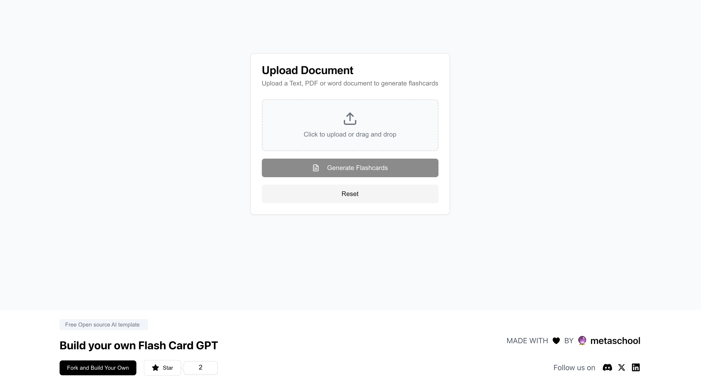

## FlashCardGPT

An AI-powered application that creates customized flashcards based on any uploaded text file, making studying easier and more effective.

## Table of Contents

- [Live Demo](#live-demo)
- [Features](#features)
- [Technologies Used](#technologies-used)
- [Getting Started](#getting-started)
  - [Prerequisites](#prerequisites)
  - [How to run the project](#how-to-run-the-project)
- [Screenshots](#screenshots)
- [How to use the application](#how-to-use-the-application)
- [Use case](#use-case)
- [Contributing](#contributing)
- [License](#license)
- [Acknowledgements](#acknowledgements)
- [Contact](#contact)

## Live Demo

https://ai-flash-card-generator-mauve.vercel.app/

## Features
- User-friendly access with social login or email/password authentication.
- Generate flashcards by uploading text files.
- Each flashcard contains AI-generated questions and answers for effective study.
- Save, edit, and organize flashcards within custom folders.

## Technologies Used
- Next.js
- React
- OpenAI API Key
- Clerk authentication


## Getting Started


**Prerequisites**

- Next.js
- Clerk credentials
- OpenAI API Key

**How to run the project**

1. Clone the repository:
    ```bash
    git clone https://github.com/muhammadtalhaamin/AI-Flash-card-generator.git
    ```

2. Navigate to the project directory:
    ```bash
    cd AI_Flashcard_Generator
    ```

3. Install dependencies:
    ```bash
    npm install
    ```

4. Set up environment variables:
   Create a .env file in the root directory as `.env.local` with the following environment variables:

    ```bash
    NEXT_PUBLIC_CLERK_PUBLISHABLE_KEY=
    CLERK_SECRET_KEY=

    NEXT_PUBLIC_CLERK_SIGN_IN_URL=
    NEXT_PUBLIC_CLERK_SIGN_UP_URL=

    OPENAI_API_KEY=
    ```
   
5. Run the development server:
    ```bash
    npm run dev
    ```

6. Run the development server:

Open the browser and go to `http://localhost:3000`. Ensure that everything is loading and the live preview works as expected.

## Screenshots

<div style="display: flex; justify-content: space-between;">   </div> <div style="margin-top: 10px;">  </div>


## How to use the application

1. Sign-in using your Google account.
2. Upload a document to generate flashcards.
3. Click on any flashcard to view the answer.
4. Review flashcards through the dashboard, and reuse as needed.


## Contributing

We love contributions! Here's how you can help make the AI-powered FinanceGuru even better:

1. Fork the project (`gh repo fork https://github.com/muhammadtalhaamin/AI-Flash-card-generator.git`)
2. Create your feature branch (`git checkout -b feature/AmazingFeature`)
3. Commit your changes (`git commit -m 'Add some AmazingFeature'`)
4. Push to the branch (`git push origin feature/AmazingFeature`)
5. Open a Pull Request

## License
This project is licensed under the MIT License - see the [LICENSE file](./LICENSE) for details.


## Acknowledgments

- OpenAI for powering the flashcard generation
- Clerk for login and authentication

## Contact

Please open an issue in the GitHub repository for any queries or support.
